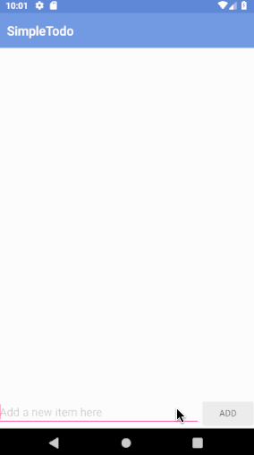

# Project 1 - *Simple Todo*

**Simple Todo** is an android app that allows building a todo list and basic todo items management functionality including adding new items, editing and deleting an existing item.

Submitted by: **Claudia Bandali**

Time spent: **4** hours spent in total

## User Stories

The following **required** functionality is completed:

* [x] User can **view a list of todo items**
* [x] User can **successfully add and remove items** from the todo list
* [x] User's **list of items persisted** upon modification and and retrieved properly on app restart

The following **optional** features are implemented:

* [ ] User can **tap a todo item in the list and bring up an edit screen for the todo item** and then have any changes to the text reflected in the todo list

The following **additional** features are implemented:

* [ ] List anything else that you can get done to improve the app functionality!

## Video Walkthrough

Here's a walkthrough of implemented user stories:

GIF created with [LiceCap](http://www.cockos.com/licecap/).

## Notes

While building this app, I ran into a couple of build errors when first creating the application as well as when adding a dependency to the gradle.build file. I was able to solve these errors by doing a bit of research. The walkthrough video
also took me about 3 trys to get perfect as pop ups from android studio interfered with the recording screen a couple of times. Ultimately, this was a great learning experience as I was able to learn a couple of tricks along the way that I was unaware of.

## License

    Copyright [2019] [Claudia Bandali]

    Licensed under the Apache License, Version 2.0 (the "License");
    you may not use this file except in compliance with the License.
    You may obtain a copy of the License at

        http://www.apache.org/licenses/LICENSE-2.0

    Unless required by applicable law or agreed to in writing, software
    distributed under the License is distributed on an "AS IS" BASIS,
    WITHOUT WARRANTIES OR CONDITIONS OF ANY KIND, either express or implied.
    See the License for the specific language governing permissions and
    limitations under the License.
